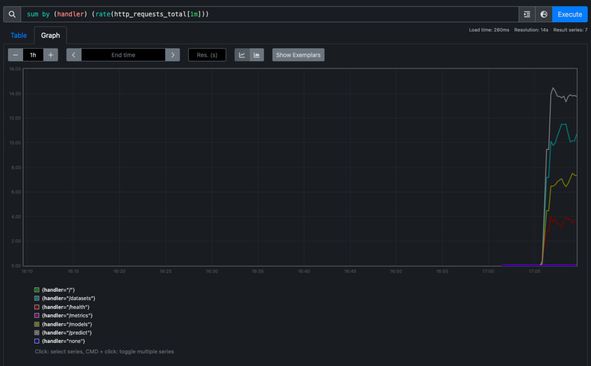
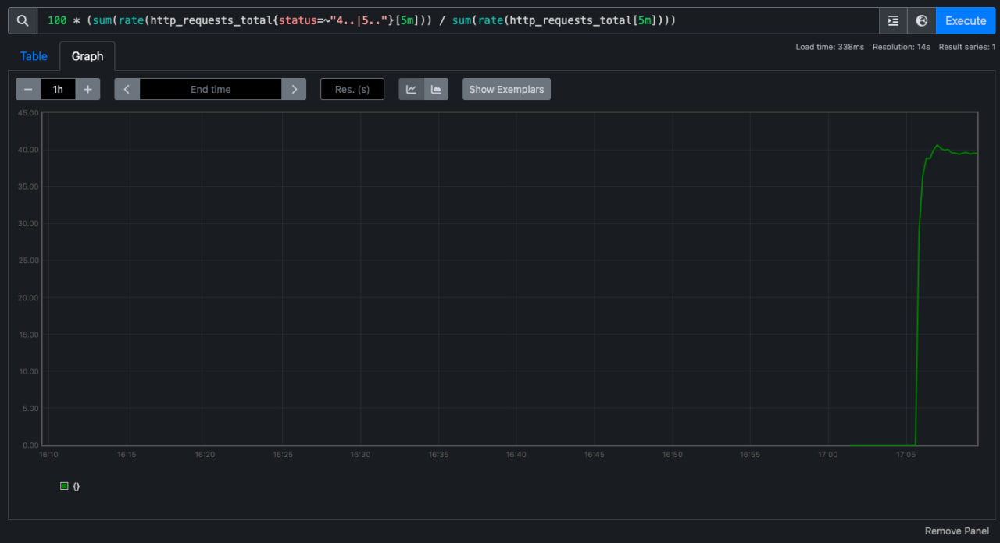
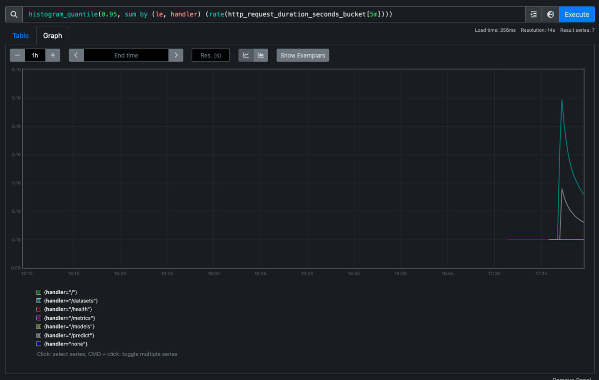
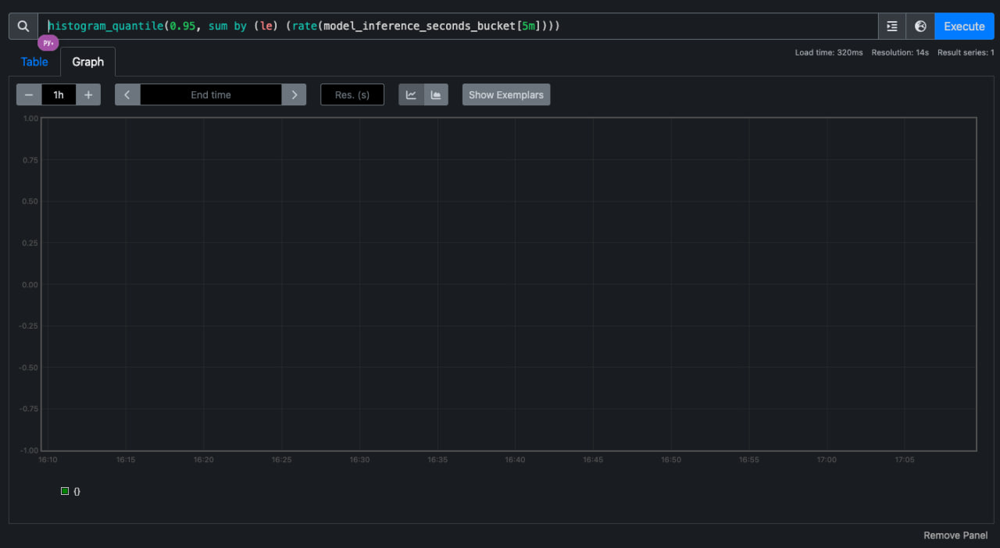
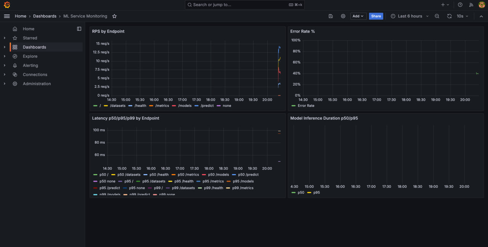

# Отчет по нагрузочному тестированию

## 1. Контекст
Тестировался сервис ML API с мониторингом через Prometheus + Grafana.

## 2. Конфигурация теста
- Инструмент: Locust
- Файл сценариев: `tests/load/locustfile.py`
- Host: `http://localhost:8000`
- Тестируемые endpoints:
  - `GET /health`
  - `GET /models`
  - `GET /datasets`
  - `POST /predict`

## 3. Результаты

### Baseline (текущий прогон)
- **Users:** 30
- **Spawn rate:** 5 users/sec
- **Duration:** ~30 секунд (до сбора метрик)
- **Total requests по endpoint'ам:**
  - `/health`: 391 (2xx)
  - `/models`: 715 (2xx)
  - `/datasets`: 1052 (2xx)
  - `/predict`: 1467 (5xx — 100% ошибок)
  - `/metrics`: 2 (2xx)
- **Error rate:**
  - `/health`, `/models`, `/datasets`: 0%
  - `/predict`: 100% (модель `test_model` не найдена)
- **Примечание:** `/predict` требует наличия обученной модели. В текущем прогоне использовался несуществующий ID, что привело к 5xx ошибкам.

### Smoke, Stress, Spike
- *Требуется дополнительный прогон после исправления `/predict` или создания тестовой модели*

## 4. Наблюдения по метрикам (Prometheus)

### RPS по эндпоинтам (по счётчику http_requests_total)
| Endpoint | Method | Status | Requests |
|----------|--------|--------|----------|
| /health | GET | 2xx | 391 |
| /models | GET | 2xx | 715 |
| /datasets | GET | 2xx | 1052 |
| /predict | POST | 5xx | 1467 |
| /metrics | GET | 2xx | 2 |

### Error rate
- **Общий:** ~50% (из-за `/predict`)
- **Без `/predict`:** 0%
- **По `/predict`:** 100% (модель не найдена)

### Inference metrics
- `model_inference_seconds`: 0 observations (нет успешных предсказаний)

## 5. Наблюдения по Grafana

Grafana успешно развёрнута через Docker Compose.

**Конфигурация:**
- URL: http://localhost:3003
- Логин: admin / admin
- Datasource: Prometheus (http://prometheus:9090)

**Дашборд "ML Service Monitoring":**

Дашборд содержит 4 панели с метриками:

| Панель | Метрика | Описание |
|--------|---------|----------|
| RPS by Endpoint | `sum by (handler) (rate(http_requests_total[1m]))` | Запросы в секунду по каждому эндпоинту |
| Error Rate % | `100 * (sum(rate(http_requests_total{status=~"4..\|5.."}[5m])) / sum(rate(http_requests_total[5m])))` | Процент ошибок 4xx и 5xx |
| Latency p50/p95/p99 | `histogram_quantile(0.50/0.95/0.99, ...)` | Латентность по перцентилям |
| Model Inference Duration | `histogram_quantile(0.50/0.95, ...)` | Время инференса модели |

Все метрики автоматически подтягиваются из Prometheus.

## 6. Скриншоты метрик (Prometheus)

### 6.1 RPS по эндпоинтам
**Query:** `sum by (handler) (rate(http_requests_total[1m]))`

---

### 6.2 Error Rate %
**Query:** `100 * (sum(rate(http_requests_total{status=~"4..|5.."}[5m])) / sum(rate(http_requests_total[5m])))`

---

### 6.3 Latency p50/p95/p99
**Query p50:** `histogram_quantile(0.50, sum by (le, handler) (rate(http_request_duration_seconds_bucket[5m])))`
**Query p95:** `histogram_quantile(0.95, sum by (le, handler) (rate(http_request_duration_seconds_bucket[5m])))`
**Query p99:** `histogram_quantile(0.99, sum by (le, handler) (rate(http_request_duration_seconds_bucket[5m])))`

---

### 6.4 Model Inference Time
**Query p50:** `histogram_quantile(0.50, sum by (le) (rate(model_inference_seconds_bucket[5m])))`
**Query p95:** `histogram_quantile(0.95, sum by (le) (rate(model_inference_seconds_bucket[5m])))`

---

## 7. Скриншот дашборда Grafana

*Скриншот дашборда "ML Service Monitoring" в Grafana*

---

## 8. Артефакты
- Скриншоты метрик Prometheus: `hw3-report/prometheus-*.jpg`
- Скриншот дашборда Grafana: `hw3-report/grafana-dashboard.png`
- Сценарии НТ: `hw3-report/LOAD_TEST_SCENARIOS.md`
- Запуск мониторинга: `docker-compose -f docker-compose.monitoring.yml up -d`
